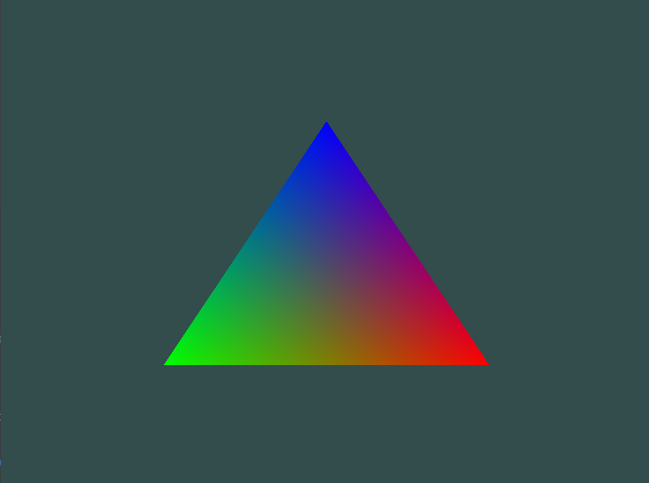
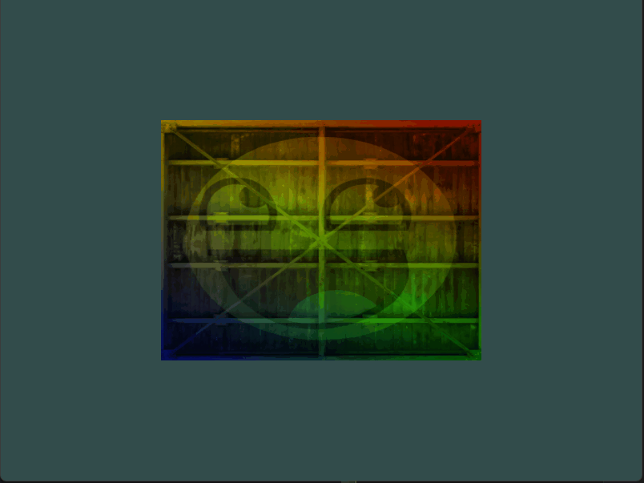
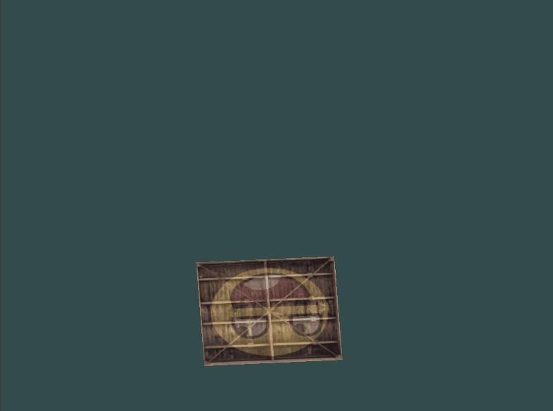
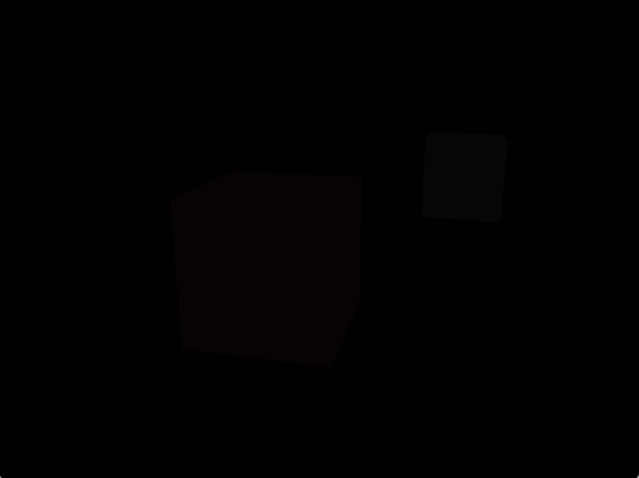

# Learn OpenGL

This repository is a collection of my own example applications for learning OpenGL.

I've picked up a little bit of graphics programming in the past, but this year, I'm setting out formally learn more about graphics programming and get into some more advanced graphics programming techniques.

Additionally, using it as an excuse to dig more into [Odin](https://odin-lang.org/).

## Resources

- [OpenGL](https://www.opengl.org/)
- [Learn OpenGL](https://learnopengl.com/)
- [GLFW](https://www.glfw.org/documentation.html)
- [Odin](https://odin-lang.org/)

## Project Setup

This project has a few requirements that are up to you to source:

- A desktop platform that supports OpenGL 3.3
- An Odin compiler. See [Odin website](https://odin-lang.org/)

Each example should be run from the root directory with `odin run example/<example-directory>`

This project was developed and tested to work on Windows. It likely doesn't work on other platforms without some additional work.

## Screenshots and GIFs

